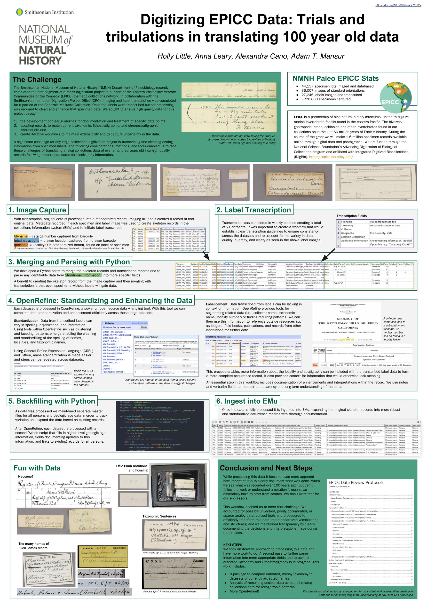

# Processing Transcription Data
### Department of Paleobiology, Smithsonian National Museum of Natural History

This respository serves as a resource for information about the tools and procedures used by The Department of Paleobiology (Paleo) to process data transcribed from labels during a mass digitization project that took place November 2017-May 2018. The project was completed in support of the Eastern Pacific Invertebrate Communities of the Cenozoic (EPICC) thematic collections network in collaboration with the Smithsonian Digitization Program Office.

The labels being transcribed varied greatly in their complexity and quality and transcribed data was limited to only six fields. The procedures, tools, and techniques shared here enabled the team to clean and enhance the resulting data, while ensuring high quality and clear documentation. 

The full workflow is summarized in the image below of a poster shared by the team at the SPNHC/TDWG 2018 meeting in Dunedin, NZ. 

